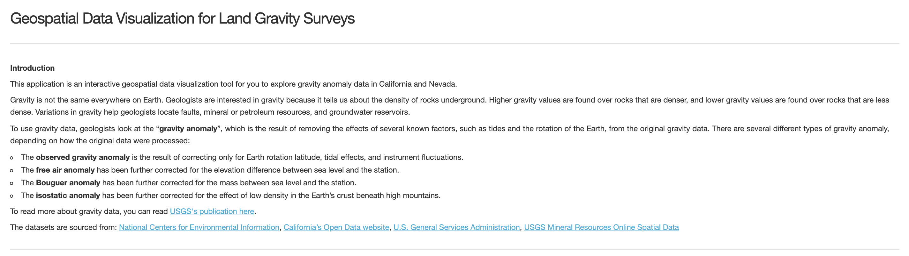
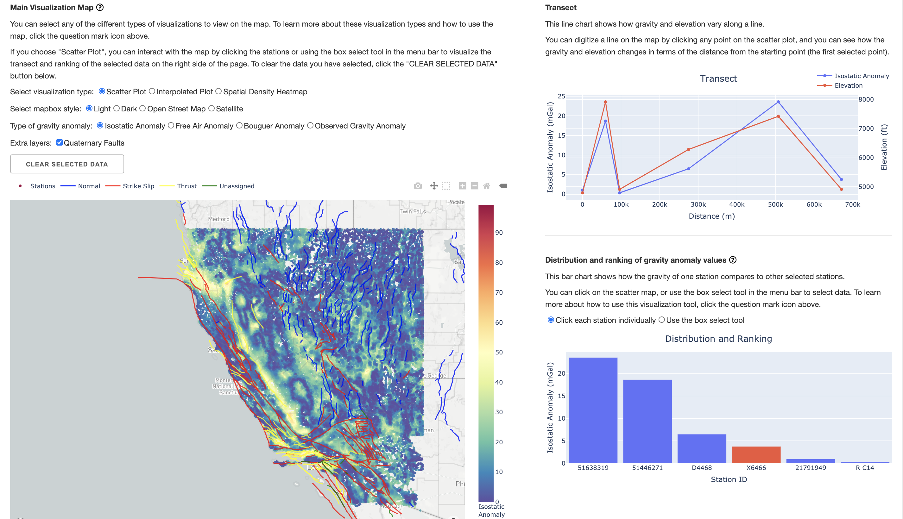

# Geospatial Data Visualization for Land Gravity Surveys

This application is an interactive geospatial data visualization tool for users to explore gravity anomaly data in California and Nevada, developed using [Plotly | Dash](https://dash.plotly.com/).

There are mainly three sections of different forms of visualizations provided by this app:
* Main Visualization Map: This is the main visualization map in the left side of the app, displaying the datasets as a map. The map listens to the click events to work with other sections.
* Transect: The transect section shows how gravity and elevation vary along a line. Users can click the points in the map to display data in the graph.
* Distribution and Ranking: The distribution and ranking section shows how the gravity of one station compares to other stations.

The datasets are sourced from: [National Centers for Environmental Information](https://www.ncei.noaa.gov/), [California’s Open Data website](https://data.ca.gov/), 
[U.S. General Services Administration](https://www.gsa.gov/), [USGS Mineral Resources Online Spatial Data](https://mrdata.usgs.gov/)

## Main Visualization Map
In the main visualization map, there are four types of properties that the user can control:
* **Visualization type**: There are three different visualization types that can be displayed in the map.
    1. **Scatter Plot**: The scatter plot displays all the data points in the dataset on the map according to their isostatic anomaly value. You can interact with the scatter plot to play with the transect and distribution sections.
    2. **Interpolated Plot**: The interpolated plot connects data points by estimating values within the gaps between stations. 
    3. **Spatial Density Heatmap**: The spatial density map shows the spatial distribution of the stations that the datasets are collection from.
* **Mapbox style**: We provide four kinds of mapbox style for you to choose from - light, dark, open street map, satellite.
* **Type of gravity anomaly**: Four types of gravity anomaly (isostatic anomaly, free air anomaly, Bouguer anomaly, observed gravity anomaly) are supported to be displayed in this app. The transect and distribution sections are also updated according to the change in the gravity anomaly type.
* **Extra layers**: Currently, we only provide quaternary faults as an extra layer that can be overlayed on top of the base visualization types. If the visualization type is set to "Scatter Plot", you can click the "Stations" on the legend above the map to hide the scatter points to show the faults layer only. Although you can also click on the legends for the faults, it will not have effects on the map due to framework limitations.

It requires lots of rendering work to display all the data points in the dataset, so please be patient while switching layers :) You can see a blue loading spinner while the map is updating.

Plotly also provides some useful buttons on the menu bar above the map. 
* Capture image: You can download the current snapshot of the map by clicking this button.
* Pan: You can view different parts of the map if you click your mouse and move it.
* Box select (mutual exclusive to the pan mode): You can use the box select tool to select multiple points at a time for the distribution and ranking section if you switch the type to "Use the box select tool". There is some lagging between the time you select and the box actaully appears on the map because of rendering latency. Unselected points are shown in a lower opacity. You can quit the box select mode by clicking the "Pan" button, but the opacity of the points can onlt be reset by refreshing the page.
* Zoom in/out: You can zoom in/out to control your view, but we don't suggested to do so because of the lagging. Instead, we suggest scrolling the mouse to control its zoom level.
* Reset view: You can reset the view of the map to the default view by clicking this button.
* Toggle hover: You can choose whether to show the metadata of each station on hover. 

## Transect
To enable the transect functionality, you should switch to the "Scatter Plot" as the visualization type. You can click any point on the scatter plot, and the point you just selected will be shown in the graph as the rightmost point. The x-axis is the cumulative distance to the starting point (the first selected point), while the y-axis shows the elevation and the gravity anomaly of this point.

(Note: the transect graph will not be updated if you choose "Use the box select tool" in the distribution and ranking section.)

If you hover on the graph, the menu bar provided by Plotly will be shown at the top.
* Capture image: You can download the current snapshot of the map by clicking this button.
* Pan: You can view different parts of the map if you click your mouse and move it.
* Zoom in/out: This is the only way that you can zoom in/out to control your view for this graph. Mouse scroll cannot be used here.
* Reset axes: You can reset the view of the graph to the default view by clicking this button.
* Toggle spike lines: You can see the spike lines together with the hover labels when hovering over each point.
* Toggle hover: You can choose whether to show the labels of each point on hover. 
* Compare data on hover: You can see the spike lines and the labels for the two points (elevation and gravity anomaly value) in the same x coordinate.

## Distribution and Ranking
To enable the distribution and ranking functionality, you should switch to the "Scatter Plot" as the visualization type. There are two ways that you can select points to be displayed in this section:
* Click each station individually: You can click any point on the scatter plot, and the point you just selected will be highlighted in red in the graph, and all the points you've selected will be sorted descendingly according to their garvity anomaly value. 
* Use the box select tool: You can select multiple points at a time by using the box select tool in the menu bar above the map to select a rectangle area in the map. If you further select a rectangle area, the points in the area will be added to the graph. If you then click any point that is inside your selected area on the map, it will show up in red. If you click other points, there will be no effects on the graph.

The menu bar is the same as transect graph.

## How to run the app
1. Install the libraries by running `pip install -r requirements.txt`.
2. Run the app in development environment by running `python app.py`. 

    If you want to deploy the app, you can start a production server using gunicorn by running `gunicorn app:server -b :8050`.
3. Open the link http://0.0.0.0:8050/ on your browser. (You can configure the host and the port in the main function in `app.py`)

## Demo

